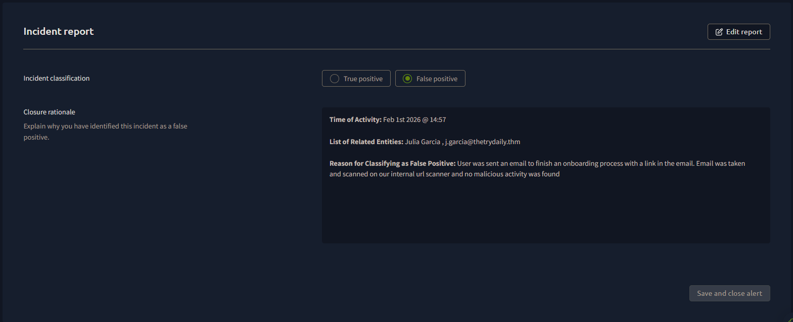

Write up 1 - Access to Blacklisted External URL Blocked by Firewall

I am given a Case report with the information needed to respond.

A suspicious phishing email was sent to a working of this company
Using the internal scanner I scan the suspicious link in the email and determine it to be non malicious but a False Positive.

All effected people were listed, report was written and ticket was closed.

