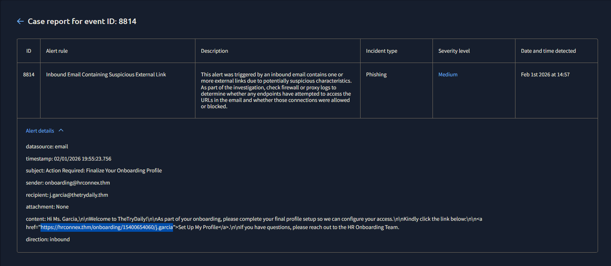
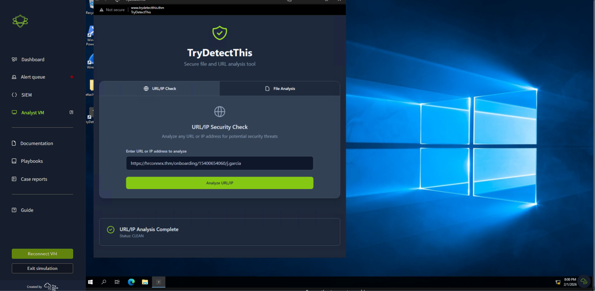
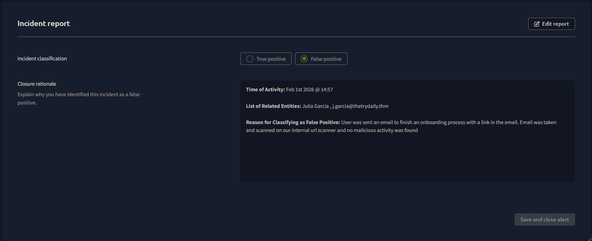

# SOC Lab #01 — Inbound Email Containing Suspicious External Link

**Platform:** TryHackMe SOC Simulator
**Date:** February 1, 2026
**Outcome:** False Positive, closed no escalation

---

## Alert Details

| Field | Value |
|---|---|
| Event ID | 8814 |
| Alert Rule | Inbound Email Containing Suspicious External Link |
| Severity | Medium |
| Date Detected | February 1st, 2026 at 14:57 |
| Data Source | Email |

---

## Investigation

Event ID 8814 was flagged on the SIEM due to an alert rule firing for an inbound email containing a suspicious external link. Opening the case in the SOC platform revealed the full email artifact details for analysis.

The sender was `onboarding@hrconnex.thm` and the recipient was `j.garcia@thetrydaily.thm`. Both domains — `hrconnex.thm` and `thetrydaily.thm` — are internal domains within the organization's environment, meaning this email originated from one internal system to another internal employee. This reduces the likelihood of an external threat actor at the sender level, though a compromised internal account is still a valid attack vector, so the alert still required full investigation.

The subject line was: **"Action Required: Finalize Your Onboarding Profile."**

This phrasing is consistent with legitimate HR onboarding communications. It uses urgency language ("Action Required"), but that is common in real onboarding workflows and is not sufficient on its own as an indicator of malicious intent.

There was no file attachment. The only potentially suspicious element was an embedded URL: `https://hrconnex.thm/onboarding/15400654060/j.garcia`.

The URL structure includes a unique numeric token (`15400654060`) and the recipient's username (`j.garcia`), which is consistent with how legitimate onboarding platforms generate per-user enrollment links. Malicious URLs occasionally mimic this pattern, so the URL still needed to be verified rather than assumed safe.

| Artifact | Value | Finding |
|---|---|---|
| Sender | onboarding@hrconnex.thm | HR onboarding platform — internal domain |
| Recipient | j.garcia@thetrydaily.thm | Internal employee — internal domain |
| Subject | Action Required: Finalize Your Onboarding Profile | Consistent with legitimate HR onboarding |
| Attachment | None | No malicious file risk |
| Embedded URL | https://hrconnex.thm/onboarding/15400654060/j.garcia | User-specific onboarding link — internal domain |

To confirm whether the URL was malicious or benign, it was submitted to TryDetectThis — the scenario's internal threat intelligence platform, functionally similar to VirusTotal, which checks submissions against known threat feeds and reputation databases to return a malicious or clean verdict.

The URL returned clean with no malicious indicators. Combined with the internal sender domain, the user-specific URL structure, and no attachment, there were no remaining indicators of compromise.

---

## Verdict

False positive. The alert fired correctly — an inbound email with an embedded link triggered the suspicious link detection rule. However, upon investigation the sender is an internal HR platform, the recipient is a legitimate internal employee, the URL matches a standard onboarding link structure, and TryDetectThis returned a clean verdict. No indicators of malicious activity were found. Alert closed with rationale documented. Detection rules do not need to be updated at this time.

---

*Write-up by Trystan Ruiz*
