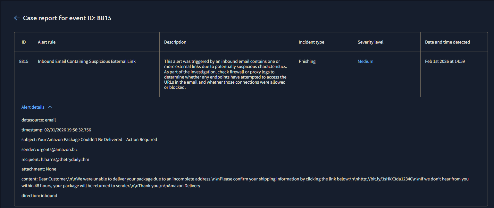
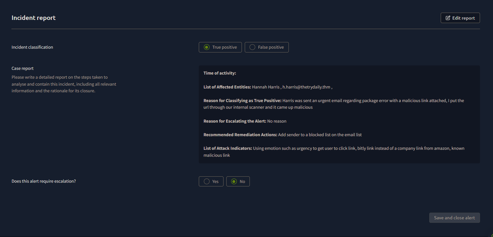
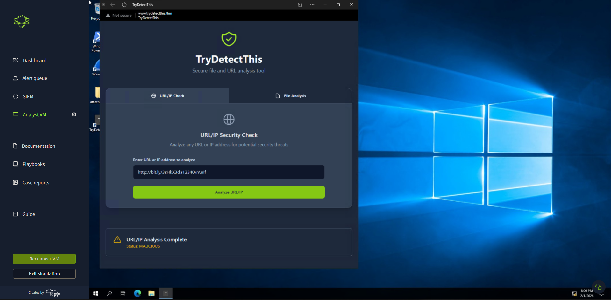

# SOC Lab #02 — Phishing Email Investigation

**Platform:** TryHackMe SOC Simulator
**Date:** February 1, 2026
**Outcome:** True Positive, closed no escalation

---

## Alert Details

| Field | Value |
|---|---|
| Event ID | 8815 |
| Alert Rule | Inbound Email Containing Suspicious External Link |
| Severity | Medium |
| Date Detected | February 1st, 2026 at 14:59 |
| Data Source | Email |

---

## What Happened

Medium severity alert came in for an inbound email with a suspicious external link. Pulled up the case for Event ID 8815.

First thing I checked was the sender — `urgents@amazon.biz`. Amazon emails come from @amazon.com, not .biz. Already a red flag before even reading the email. Subject line was "Your Amazon Package Couldn't Be Delivered – Action Required" which is the oldest urgency trick in the book.

The email had no attachment but had a bit.ly link telling the user to click and confirm their shipping info. bit.ly shorteners are worth flagging on their own since they hide where the link actually goes.

**Email artifacts:**

| Artifact | Value | Finding |
|---|---|---|
| Sender | urgents@amazon.biz | Suspicious — legitimate Amazon uses @amazon.com |
| Recipient | h.harris@thetrydaily.thm | Internal employee targeted |
| Subject | Your Amazon Package Couldn't Be Delivered – Action Required | Urgency lure |
| Attachment | None | |
| Direction | Inbound | External sender |
| Embedded URL | http://bit.ly/3sHkX3da12340 | URL-shortened, destination unknown |

Ran the bit.ly link through TryDetectThis to see where it goes.

Came back malicious. That was enough to close this as a true positive.

---

## IOC Summary

| IOC Type | Value | Confidence |
|---|---|---|
| Malicious URL | http://bit.ly/3sHkX3da12340 | High |
| Spoofed Sender Domain | urgents@amazon.biz | High |

---

## MITRE ATT&CK

| Technique ID | Technique Name | Notes |
|---|---|---|
| T1566.002 | Phishing: Spearphishing Link | Malicious URL sent via email to internal employee |
| T1036.005 | Masquerading: Match Legitimate Name | Sender spoofing Amazon domain |
| T1204.001 | User Execution: Malicious Link | User prompted to click link to confirm shipping info |

---

## Verdict

True positive. The sender domain was spoofed, the link confirmed malicious. No evidence h.harris actually clicked it so no escalation needed — just blocked the domain at the email gateway, quarantined the email, and flagged the bit.ly URL.

Worth noting: medium severity still needs full triage. This could've led to credential theft if the user clicked.

---

*Write-up by Trystan Ruiz*
