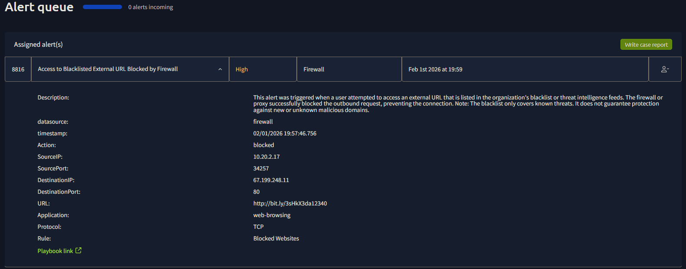
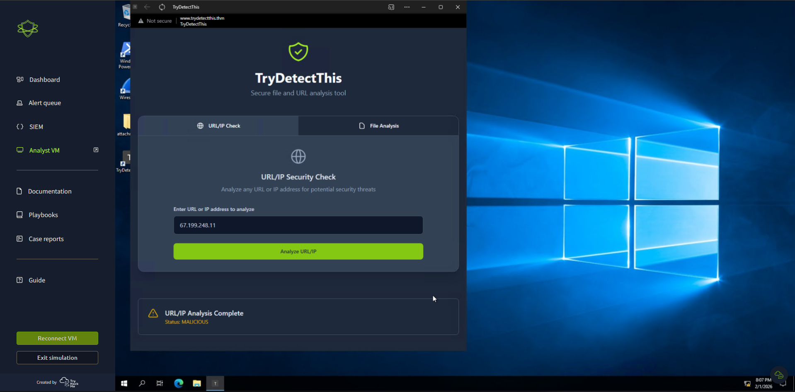
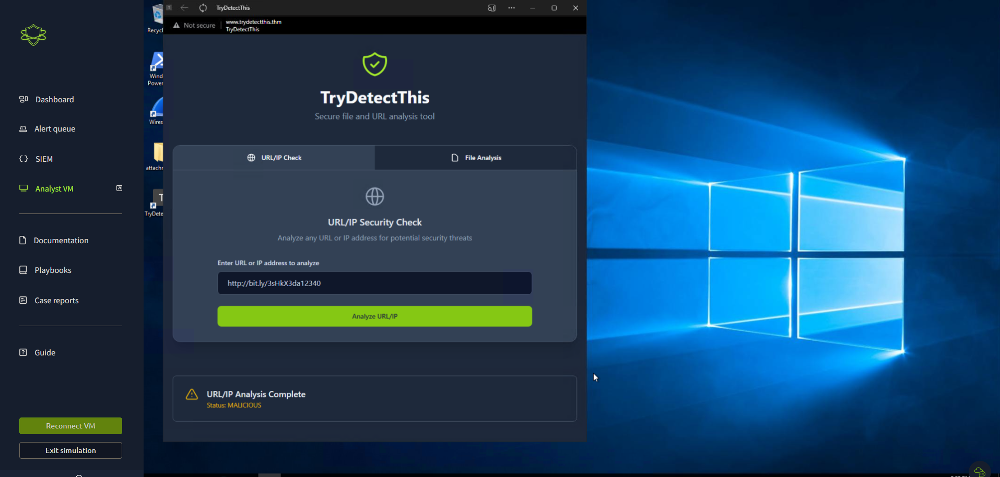
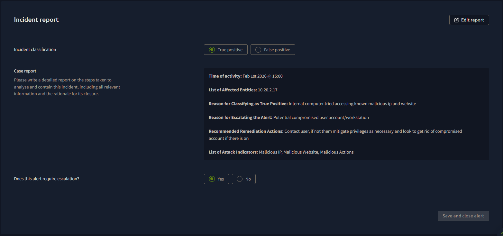

# SOC Lab #03 — Firewall Alert: Access to Blacklisted External URL

---

## Overview

High severity firewall alert — an internal host tried to reach a blacklisted external URL and got blocked. Once I pulled the logs I recognized the URL from the phishing email in Lab #02, which meant the user actually clicked the link. Had to escalate this one.

---

## Alert Details

| Field | Value |
|---|---|
| Event ID | 8816 |
| Alert Rule | Access to Blacklisted External URL Blocked by Firewall |
| Incident Type | Firewall |
| Severity | **High** |
| Date Detected | February 1st, 2026 at 19:59 |
| Data Source | Firewall |
| Action Taken | Blocked |

---

## Investigation

### Step 1 — Alert Triage

Pulled up Event ID 8816. Firewall flagged an outbound connection from an internal host to an IP on the blacklist. Connection got blocked, but the fact that it tried at all means something triggered it.

*Figure 1: Alert queue entry for Event ID 8816 — Access to Blacklisted External URL Blocked by Firewall*

**Firewall log breakdown:**

| Field | Value | Significance |
|---|---|---|
| Source IP | 10.20.2.17 | Internal endpoint — potential victim host |
| Source Port | 34257 | Ephemeral port — outbound connection initiated by host |
| Destination IP | 67.199.248.11 | External IP — blacklisted |
| Destination Port | 80 | HTTP — unencrypted web traffic |
| URL | http://bit.ly/3sHkX3da12340 | Same malicious URL from Lab #02 phishing email |
| Application | Web-browsing | User-initiated browser request |
| Protocol | TCP | Standard web connection |
| Rule Triggered | Blocked Websites | Firewall blacklist rule fired |

The URL in the log was `http://bit.ly/3sHkX3da12340` — the exact same link from the phishing email in Lab #02. So `h.harris` clicked it.

---

### Step 2 — IP Reputation Analysis

Pulled the destination IP `67.199.248.11` and ran it through TryDetectThis separately from the URL to double check.

**IP submitted:** `67.199.248.11`

**Result: MALICIOUS**

*Figure 2: TryDetectThis URL/IP Security Check confirming MALICIOUS status for destination IP 67.199.248.11*

---

### Step 3 — URL Reputation Confirmation

Also ran the URL itself to confirm both were flagged independently.

**URL submitted:** `http://bit.ly/3sHkX3da12340`

**Result: MALICIOUS**

*Figure 3: TryDetectThis confirming MALICIOUS status for the embedded bit.ly URL*

Both came back malicious. No way this is a false positive.

---

### Step 4 — Incident Report & Escalation Decision

Both checks confirmed malicious infrastructure and the source IP pointed to an internal workstation. Filled out the incident report and escalated.

*Figure 4: Completed incident report — True Positive, escalated due to potential compromised workstation*

**Incident report summary:**

| Field | Detail |
|---|---|
| Time of Activity | Feb 1st 2026 @ 15:00 |
| Affected Entity | 10.20.2.17 |
| Classification | True Positive |
| Reason for True Positive | Internal computer attempted to access a known malicious IP and website |
| Reason for Escalation | Potential compromised user account and/or workstation |

---

## IOC Summary

| IOC Type | Value | Confidence |
|---|---|---|
| Malicious Destination IP | 67.199.248.11 | High |
| Malicious URL | http://bit.ly/3sHkX3da12340 | High |
| Affected Internal Host | 10.20.2.17 | High |
| Protocol/Port | TCP/80 | Medium |

---

## MITRE ATT&CK Mapping

| Technique ID | Technique Name | Observed Behavior |
|---|---|---|
| T1566.002 | Phishing: Spearphishing Link | User clicked malicious link from phishing email (Lab #02) |
| T1204.001 | User Execution: Malicious Link | Internal host initiated outbound connection to attacker infrastructure |
| T1071.001 | Application Layer Protocol: Web Protocols | Outbound HTTP connection over TCP/80 to attacker IP |
| T1090 | Proxy | Bit.ly URL shortener used to redirect to malicious destination |

---

## Verdict & Response

**Classification:** True Positive
**Escalation Required:** Yes

`h.harris@thetrydaily.thm` clicked the link from the phishing email. Their workstation (`10.20.2.17`) tried to connect out to `67.199.248.11`. Firewall caught it but we still don't know if anything was entered before the connection got blocked, so it needed to go up.

**Recommended remediation actions:**

- Contact the user tied to `10.20.2.17` and find out if they entered any credentials before the connection was cut
- If anything is unclear, isolate `10.20.2.17` from the network immediately
- Reset credentials on the affected account as a precaution
- Pull the endpoint logs on `10.20.2.17` and look for anything else suspicious
- Make sure `67.199.248.11` and the bit.ly URL are blocked org-wide

---

## Connection to Lab #02

This is a direct follow-on from [SOC Lab #02](../THM-Writeup-2/README.md). The phishing email came in at 14:59 and by 15:00 the user had already clicked the link.

| Time | Event |
|---|---|
| 14:59 | Phishing email delivered to h.harris@thetrydaily.thm (Lab #02) |
| 15:00 | User clicks malicious link — outbound connection attempt from 10.20.2.17 |
| 19:59 | Firewall alert fires on blacklisted URL access (Lab #03) |

Working these tickets in isolation would have missed the full picture. The firewall alert alone just looks like a blocked connection — correlating it back to the phishing email tells you exactly what happened and why.

---

## Key Takeaways

- A blocked firewall connection is not a closed case. Something caused it and you need to find out what
- Tying this back to Lab #02 made everything clear. The phishing email was the root cause
- This went from medium severity (phishing) to high (potential compromised host) the moment the user clicked. That escalation difference matters
- Running the IP and URL through rep checks independently gives you more confidence before escalating — if either came back clean it would've changed the analysis

---

*Write-up by Trystan Ruiz*
