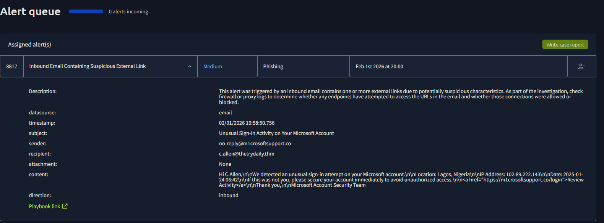
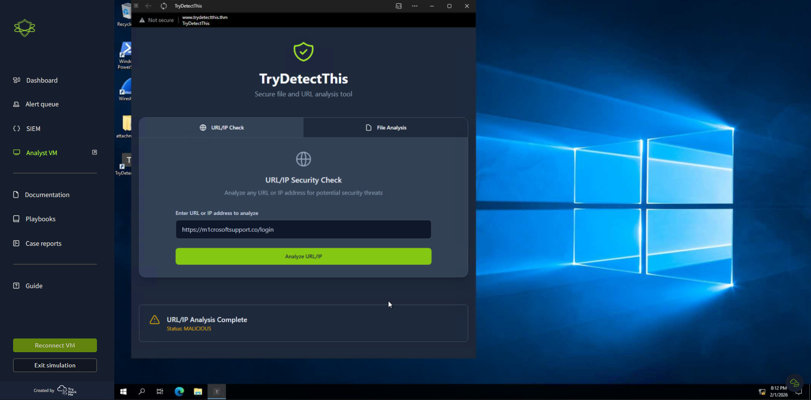
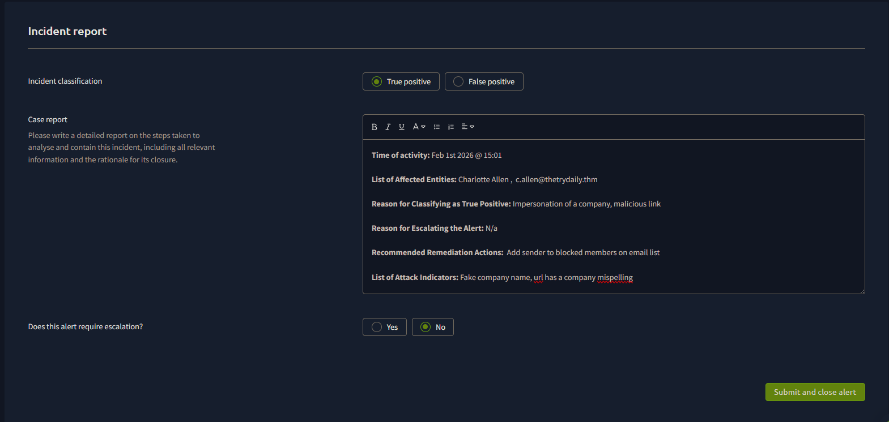

# SOC Lab #04 — Microsoft Account Impersonation Phishing

**Platform:** TryHackMe SOC Simulator
**Date:** February 1, 2026
**Outcome:** True Positive, closed no escalation

---

## Alert Details

| Field | Value |
|---|---|
| Event ID | 8817 |
| Alert Rule | Inbound Email Containing Suspicious External Link |
| Severity | Medium |
| Date Detected | February 1st, 2026 at 20:00 |
| Data Source | Email |

---

## Investigation

Pulled up Event ID 8817. Inbound email flagged for a suspicious link.

Sender was `no-reply@m1crosoftsupport.co` — "i" swapped for "1" in Microsoft. Subject was "Unusual Sign-In Activity on Your Microsoft Account." Email body referenced a sign-in from Lagos, Nigeria (`102.89.222.143`) as the supposed suspicious location. Link goes to `https://m1crosoftsupport.co/login`.

| Artifact | Value | Finding |
|---|---|---|
| Sender | no-reply@m1crosoftsupport.co | Typosquatting — "i" replaced with "1" |
| Recipient | c.allen@thetrydaily.thm | Internal employee |
| Subject | Unusual Sign-In Activity on Your Microsoft Account | Fear/urgency lure |
| Embedded URL | https://m1crosoftsupport.co/login | Fake Microsoft login page |
| IP in Email Body | 102.89.222.143 | Lagos, Nigeria |

Ran the URL through TryDetectThis.

Malicious.

---

## IOC Summary

| IOC Type | Value | Confidence |
|---|---|---|
| Typosquatted Domain | m1crosoftsupport.co | High |
| Malicious URL | https://m1crosoftsupport.co/login | High |
| IP in Email Body | 102.89.222.143 | Medium |

---

## MITRE ATT&CK

| Technique ID | Technique Name | Notes |
|---|---|---|
| T1566.002 | Phishing: Spearphishing Link | Malicious URL targeting internal employee |
| T1036.005 | Masquerading: Match Legitimate Name | Typosquatted domain impersonating Microsoft |
| T1078 | Valid Accounts | Credential harvesting via fake login page |
| T1204.001 | User Execution: Malicious Link | User prompted to click fake login link |

---

## Verdict

True positive. Typosquatted domain, malicious URL confirmed. No evidence c.allen clicked it — blocked the domain, quarantined the email, added the IP to the blocklist. Notified the user about the typosquatting.

---

*Write-up by Trystan Ruiz*
